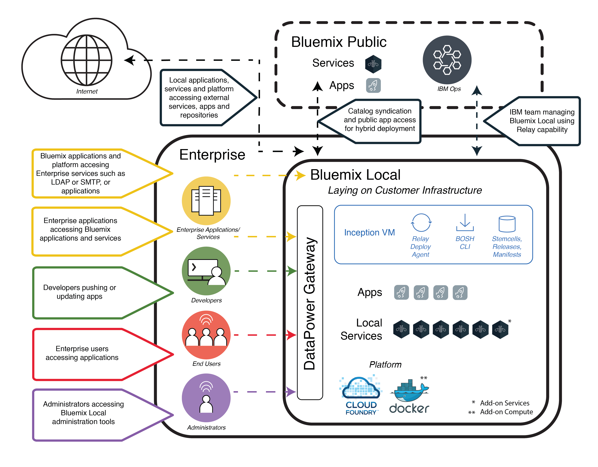

---

copyright:

  years: 2015, 2018

lastupdated: "2017-12-15"

---

{:new_window: target="_blank"}
{:shortdesc: .shortdesc}

# {{site.data.keyword.Bluemix_local_notm}}
{: #local}

{{site.data.keyword.Bluemix_local}} brings the power and agility of the {{site.data.keyword.Bluemix_notm}} cloud-based platform to your data center. With {{site.data.keyword.Bluemix_local_notm}}, you can protect your most sensitive workloads behind your company firewall, while staying securely connected and in sync with {{site.data.keyword.Bluemix_notm}} Public.
{:shortdesc}

IBM® uses cloud operations as a service to monitor and maintain your environment, so that you can focus on building apps and services that run on top of the environment. {{site.data.keyword.IBM_notm}} also handles platform updates, so that you can focus on the business.

{{site.data.keyword.Bluemix_local_notm}} environments have the same security standards as the public {{site.data.keyword.Bluemix_notm}} in terms of operational security. You provide the hardware and infrastructure, which gives you control over infrastructure and physical [security](/docs/security/index.html#localplatformsecurity). Developer access to the local {{site.data.keyword.Bluemix_notm}} environment is controlled by your LDAP policies, which can be configured by the {{site.data.keyword.Bluemix_notm}} team when they set up your environment. Within the local environment, using the Administration page, you can [manage users and permissions](/docs/admin/index.html#oc_useradmin).

{{site.data.keyword.Bluemix_local_notm}} comes with all included {{site.data.keyword.Bluemix_notm}} runtimes and 64 GB of compute memory.

In addition, there is a set of services that are available as {{site.data.keyword.Bluemix_local_notm}} services. Review the following table to see what is included and what is available for you to purchase.

| **Type** | **Name** | **Description** |
|----------|----------|-----------------|
|Included | {{site.data.keyword.Bluemix_notm}} runtimes | Use runtimes to get your app up and running quickly, with no need to set up and manage machines and operating systems. All {{site.data.keyword.Bluemix_notm}} runtimes are available for you to use in your {{site.data.keyword.Bluemix_local_notm}} instance.|
|Included | [{{site.data.keyword.autoscaling}}](/docs/services/Auto-Scaling/index.html)| Dynamically increase or decrease the compute capacity of your application based on policies. With this service, you have unlimited use in your {{site.data.keyword.Bluemix_local_notm}} environment.|
|Optional | [{{site.data.keyword.apiconnect_short}}](/docs/services/apiconnect/index.html) | {{site.data.keyword.apiconnect_long}} integrates {{site.data.keyword.APIM}} and IBM StrongLoop into a single offering that provides a comprehensive solution to create, run, manage, and enforce APIs and microservices. |
|Optional | [{{site.data.keyword.containershort}}](/docs/containers/container_index.html) | Run Docker containers on {{site.data.keyword.Bluemix_local_notm}}. Containers are virtual software objects that include all of the elements that an app needs to run. A container has the benefits of resource isolation and allocation, but is more portable and efficient than, for example, a virtual machine. For information about the hardware requirements, see [IBM {{site.data.keyword.containershort}} in {{site.data.keyword.Bluemix_dedicated_notm}} and {{site.data.keyword.Bluemix_local_notm}}](/docs/containers/container_ov.html#container_dl). |
| Optional (Beta) | [Logging](/docs/monitor_log/logging/dedicated/logging_local_dedicated.html#hybrid_apps_logs_dash) | Provides logs for your Cloud Foundry apps in your {{site.data.keyword.Bluemix_notm}} user interface and searchable logs and dashboards in Kibana. |
|Optional | [{{site.data.keyword.mobilepush}}](/docs/services/mobilepush/index.html) | {{site.data.keyword.mobilepush}} is a service that you can use to send notifications to iOS and Android device. Notifications can be targeted to all application users or to a specific set of users and devices using tags. You can administer devices, tags, and subscriptions. You can also use an SDK (software development kit) and Representational State Transfer (REST) application program interface (APIs) to further develop your client applications. |
|Optional | [{{site.data.keyword.iot_short}}](/docs/services/IoT/index.html) | This service lets your apps communicate with and consume data collected by your connected devices, sensors and gateways. The local base offering includes an initial environment that permits running a private version of the IBM {{site.data.keyword.iot_short}} within the local environment with a capacity of 100,000 concurrently connected devices or applications and 1.6 TB of data exchange. |
{: caption="Table 1. Local services and runtimes" caption-side="top"}
{: #table01}

There are optional components that are available for you to purchase to scale and extend the capacity of your resources and services. You can purchase any of these components by contacting the sales team; go to [Contact us](https://console.ng.bluemix.net/?direct=classic/#/contactUs/cloudOEPaneId=contactUs) for information about contacting a sales representative. To increase your plan for a service, you can select the plan from the service tile in your catalog.

| **Name** | **Description** |
|----------|-----------------|
|{{site.data.keyword.Bluemix_local_notm}} {{site.data.keyword.apiconnect_short}} Professional 5 Million API Calls | An environment that permits running a private version of {{site.data.keyword.apiconnect_short}} with a capacity of 5 million API Calls a month targeted towards departmental API projects. |
|{{site.data.keyword.Bluemix_local_notm}} {{site.data.keyword.apiconnect_short}} Professional 100 thousand API Calls increase| An extension of the {{site.data.keyword.apiconnect_short}} Professional environment to provide additional capacity of 100 thousand API Calls a month. |
|{{site.data.keyword.Bluemix_local_notm}} {{site.data.keyword.apiconnect_short}} Enterprise 25 Million API Calls | An environment that permits running a private version of {{site.data.keyword.apiconnect_short}} with a capacity of 25 million API Calls a month targeted towards enterprise wide API projects. |
|{{site.data.keyword.Bluemix_local_notm}} {{site.data.keyword.apiconnect_short}} Enterprise 100 thousand API Calls increase | An extension of the {{site.data.keyword.apiconnect_short}} Enterprise environment to provide additional capacity of 100 thousand API Calls a month. |
|{{site.data.keyword.Bluemix_notm}} {{site.data.keyword.iot_short}} local incremental increase | An environment additional to the {{site.data.keyword.iot_short}} local base service offering that permits running a private version of the {{site.data.keyword.iot_short}} within the local environment with a capacity of 100,000 concurrently connected devices or applications and 0.5 TB of data exchange. |
|{{site.data.keyword.IBM_notm}} {{site.data.keyword.mobilepush}} local add-on instance | An environment that permits the deployment and running of {{site.data.keyword.mobilepush}} instance with the ability to accept 300 additional requests per second. |
{: caption="Table 2. Optional services components for purchase" caption-side="top"}
{: #table02}

| **Name** | **Description** |
|----------|-----------------|
|Local Cloud Foundry runtimes 64 GB capacity  | Cloud Foundry runtimes environment with 64 GB of runtime capacity. |
|Local Cloud Foundry runtimes 16 GB capacity increase  | An extension of the Cloud Foundry runtimes environment to provide an extra 16 GB of runtime capacity. |
|Local {{site.data.keyword.containerlong}} 16 GB capacity increase  | An extension of the {{site.data.keyword.containerlong}} environment to provide an extra 16 GB of capacity. |
|Local {{site.data.keyword.containerlong}} 64 GB capacity  | {{site.data.keyword.containerlong}} environment with 64 GB of capacity. |
{: caption="Table 3. Optional platform add-on components for purchase" caption-side="top"}
{: #table03}

**Note**: {{site.data.keyword.Bluemix_local_notm}} components might indicate a specific configured capacity, such as gigabytes or transactions per second. Because actual capacity in practice for any configuration of the cloud service varies depending on many factors, the actual capacity in practice might be more or less than the configured capacity.

## Syndicated catalog
{: #cataloglocal}

{{site.data.keyword.Bluemix_local_notm}} includes a private catalog that brings together approved services across your public and local deployments. You can even publish and manage access to your own services through the {{site.data.keyword.Bluemix_notm}} catalog. You have the option to decide which public services meet the requirements for your business, based on your data privacy and security criteria.

If you have a private instance of a {{site.data.keyword.Bluemix_notm}} service for your local environment, you see a "Local" tag with the service names in your catalog administration view. Similarly, if it is a custom service, meaning you used a service broker to create it, you see "Custom" listed with the service name. All other services listed that do not have a "local" or "custom" tag are available by using syndication from {{site.data.keyword.Bluemix_notm}} Public. Syndicated services provide the function to create hybrid applications that consist of public and private services.

|Service	|Available in US South region	|Available in Europe United Kingdom region |Available in Germany region|Available in US East region|Available in Australian Sydney region|
|:----------|:------------------------------|:------------------|:------------------|:------------------|:--------------|
|{{site.data.keyword.alertnotificationshort}} | Yes | Yes | No | No | Yes |
|{{site.data.keyword.appseccloudshort}}		| Yes		| Yes		| No | No | Yes |
|Automated Accessibility Checker | Yes       | Yes    | Yes   | No  | Yes |
|{{site.data.keyword.cloudant}}			| Yes		| Yes		| Yes | Yes | Yes |
|{{site.data.keyword.evtmgt_short}} | Yes | Yes | No | No | Yes |
|{{site.data.keyword.iotmapinsights_short}}    | Yes | Yes | No | No | Yes |
|{{site.data.keyword.uccr_short}} | Yes | No | No | No | No |
|{{site.data.keyword.conversationshort}}  | Yes | Yes | Yes | No | Yes |
|{{site.data.keyword.dataworks_short}}		| Yes		| Yes		| No | No | No |
|Db2 hosted | Yes | Yes | Yes | No | Yes |
|{{site.data.keyword.DB2OnCloud_short}}		| Yes		| Yes		| Yes | No | Yes |
|{{site.data.keyword.dashdbshort_notm}} | Yes | Yes | Yes | No | Yes |
|Digital Content Checker | Yes | Yes | No | No | Yes |
|{{site.data.keyword.servicediscoveryshort}} | Yes | Yes | No | No | Yes |
|{{site.data.keyword.documentconversionshort}}	| Yes		| Yes		| No | No | Yes |
|{{site.data.keyword.iotdriverinsights_short}}  | Yes | Yes | No | No | Yes |
|{{site.data.keyword.geospatialshort_Geospatial}}	| Yes	| Yes		| No | No | Yes |
|{{site.data.keyword.GlobalizationPipeline_short}}	| Yes		| Yes		| Yes | No | Yes |
|{{site.data.keyword.identitymixershort}}		| Yes		| Yes		| No | No | Yes |
|{{site.data.keyword.iot4auto_short}} | Yes | Yes | No | No | Yes |
|{{site.data.keyword.iotelectronics}}  | Yes  | Yes  | No | No | No |
|{{site.data.keyword.languagetranslatorshort}} | Yes | Yes | Yes | No | Yes |
|{{site.data.keyword.dwl_short}}  | Yes | Yes | No | No | No |
|{{site.data.keyword.pm_short}} | Yes | Yes | No | No | No |
|{{site.data.keyword.messagehub}}		| Yes		| Yes		| Yes | No | Yes |
|{{site.data.keyword.manda}}			| Yes		| Yes		| No | No | Yes |
|{{site.data.keyword.nlclassifiershort}} 	| Yes 		| Yes 		| No | No | Yes |
|{{site.data.keyword.nlushort}} | Yes | Yes | No | No | Yes |
|{{site.data.keyword.personalityinsightsshort}}	| Yes		| Yes		| Yes| No | Yes |
|{{site.data.keyword.mobilepushshort}}		| Yes		| Yes		| Yes | No | Yes |
|{{site.data.keyword.retrieveandrankshort}}	| Yes 		| Yes 		| No| No | Yes |
|{{site.data.keyword.SecureGateway}}		| Yes		| Yes		| Yes | Yes | Yes |
|{{site.data.keyword.ssofull}}			| Yes		| No		| No| No | No |
|{{site.data.keyword.speechtotextshort}}	| Yes 		| Yes	 	| Yes| No | Yes |
|{{site.data.keyword.streaminganalyticsshort}}	| Yes		| Yes		| No | No | Yes |
|{{site.data.keyword.texttospeechshort}} 	| Yes 		| Yes	 	| Yes| No | Yes |
|{{site.data.keyword.toneanalyzershort}} 	| Yes 		| Yes 		| Yes| No | Yes |
|{{site.data.keyword.visualrecognitionshort}}	| Yes 		| Yes	 	| No | No | Yes |
|{{site.data.keyword.weather_short}}		| Yes		| Yes		| No | No | Yes |
|{{site.data.keyword.workloadscheduler}}	| Yes		| Yes		| Yes | No | Yes |
{: caption="Table 4. Services available for syndication from {{site.data.keyword.Bluemix_notm}} Public by region" caption-side="top"}
{: #table04}

**Note**: Third-party services are not included in the table. Check your catalog for third-party service options.

## {{site.data.keyword.Bluemix_local_notm}} architecture
{: #localarch}

{{site.data.keyword.Bluemix_local_notm}} sits on a virtualized infrastructure that is behind your Enterprise firewall, providing the highest performing and most secure cloud infrastructure to you. {{site.data.keyword.IBM_notm}} installs, remotely monitors, and manages {{site.data.keyword.Bluemix_local_notm}} in your data center through {{site.data.keyword.IBM_notm}}'s [Relay](#localrelay) technology. The logical architecture in [Figure 1](#figure01) describes how {{site.data.keyword.Bluemix_notm}} is set up in your local environment and how {{site.data.keyword.IBM_notm}} maintains your local instance:

Figure 1. {{site.data.keyword.Bluemix_local_notm}} architecture
{: #figure01}

The inception virtual machine (inception VM) runs on your enterprise virtualized infrastructure behind your enterprise firewall. The inception VM creates an outbound network connection to the {{site.data.keyword.IBM_notm}} Operations center through the {{site.data.keyword.IBM_notm}} relay technology. Relay performs several functions and is described in following [Relay](#localrelay) section.

The {{site.data.keyword.Bluemix_notm}} platform components and core features that support the platform components run in a private, isolated virtual local area network (VLAN). {{site.data.keyword.Bluemix_local_notm}} uses a VLAN for the private subnet. Using a private subnet rather than a public VLAN is more secure and can help avoid routing issues. The set of core features that make up and support the platform include the following:

<dl>
<dt>Platform</dt>
<dd>At a minimum, the platofrm is Cloud Foundry components and some local application services. {{site.data.keyword.Bluemix_notm}} provides both Cloud Foundry and {{site.data.keyword.containerlong}}-based compute environments. An enterprise may have one or both of these compute environments configured. 
An enterprise may also add additional local application services. 

Refer to [Optional components for purchase: Services add-ons](#table02) and [Optional components for purchase: Platform add-ons](#table03) for additional services and compute capabilities that may be added.

</dd>
<dt>{{site.data.keyword.Bluemix_notm}} Public</dt>
<dd>
A {{site.data.keyword.Bluemix_local_notm}} environment might have an outbound connection to a {{site.data.keyword.Bluemix_notm}} Public region. A connection to public enables syndication of public services onto the local catalog. {{site.data.keyword.Bluemix_notm}} Public service syndication provides a convenient method for developers to build applications hosted on the enterprise's {{site.data.keyword.Bluemix_local_notm}} environment as well as access to services running in {{site.data.keyword.Bluemix_notm}} Public. See the list of {{site.data.keyword.IBM_notm}} services that can be syndicated from {{site.data.keyword.Bluemix_notm}} Public in the [Syndicated catalog](#cataloglocal) section.
</dd>
<dt>{{site.data.keyword.IBM_notm}} Operations</dt>
<dd>
{{site.data.keyword.IBM_notm}} manages, monitors, and maintains the local platform and local services, so that you can focus on building innovative applications. The {{site.data.keyword.IBM_notm}} Operations Support Services (OSS) team performs operations by using a VPN tunnel connection from the inception VM to {{site.data.keyword.IBM_notm}}'s Operations network.
</dd>
<dt>Enterprise</dt>
<dd>
The enterprise network environment has a bi-directional network link to {{site.data.keyword.Bluemix_local_notm}}. This allows applications hosted in {{site.data.keyword.Bluemix_local_notm}} to access services and resources in the enterprise, including data sources and enterprise services. The network link also allows {{site.data.keyword.Bluemix_local_notm}} to use your LDAP for authentication of your developers and administrators.
</dd>
<dt>Local services</dt>
<dd>A set of services are available to be used privately in your {{site.data.keyword.Bluemix_local_notm}} environment. Typically, you decide which services you want for your environment prior to the deployment by the {{site.data.keyword.IBM_notm}} team. For a list of available services, go to [Local services and runtimes](#table01).
</dd>
<dt>DataPower Gateway</dt>
<dd>
{{site.data.keyword.IBM_notm}} DataPower Gateway appliances provide access to {{site.data.keyword.Bluemix_notm}} application domains. These appliances connect to your intranet network and to the {{site.data.keyword.Bluemix_notm}} private network, providing a secure gateway to the {{site.data.keyword.Bluemix_notm}} deployment. Your developers, who are deploying apps and services, get access from your intranet through this gateway. The users of the applications will get access through the DataPower appliances as well as your administrators.
</dd>
<dt>Security intelligence</dt>
<dd>
{{site.data.keyword.IBM_notm}} uses QRadar Security Intelligence Platform to provide a unified architecture for integrating several key components. These components include security information and event management, log management, anomaly detection, incident forensics, and configuration and vulnerability management. {{site.data.keyword.Bluemix_notm}} also uses {{site.data.keyword.IBM_notm}} QRadar security information and event management (SIEM) to monitor privileged user actions and successful and unsuccessful login attempts of application developers. QRadar reports provide the customer with visibility on by using the Reports and Logs section on the Administration page. For information about security reports, see [Viewing reports](/docs/admin/index.html#oc_report).

{{site.data.keyword.IBM_notm}} BigFix ensures that fixes for operating systems are applied at appropriate frequencies. The patching process is automated, and the schedule is agreed upon between you and IBM. For information about maintenance and upgrades, see [Maintaining your local instance](index.html#maintainlocal).

</dd>
</dl>

Your apps are deployed inside virtual containers that run on Cloud Foundry virtual machines. All Cloud Foundry components, such as cloud controllers, health managers, routers, and droplet execution agents (DEAs) are deployed when {{site.data.keyword.Bluemix_notm}} is set up. The various {{site.data.keyword.Bluemix_notm}} management components are also included in the {{site.data.keyword.Bluemix_notm}} deployment.

For information about the network specifications and infrastructure requirements, go to [{{site.data.keyword.Bluemix_local_notm}} infrastructure requirements](/docs/local/index.html#localinfra).

### Relay
{: #localrelay
